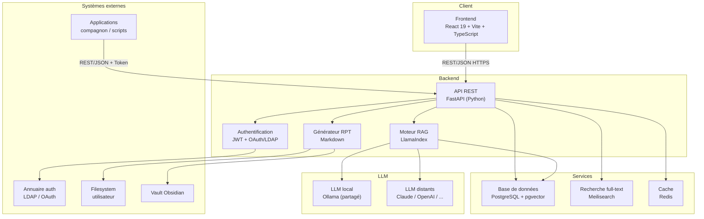
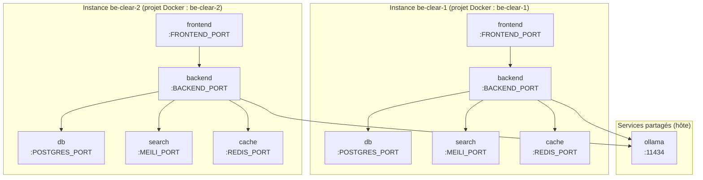
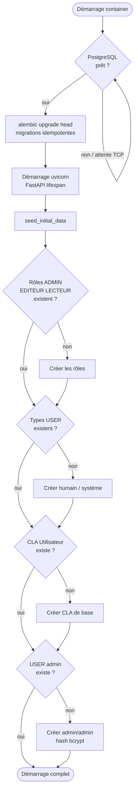
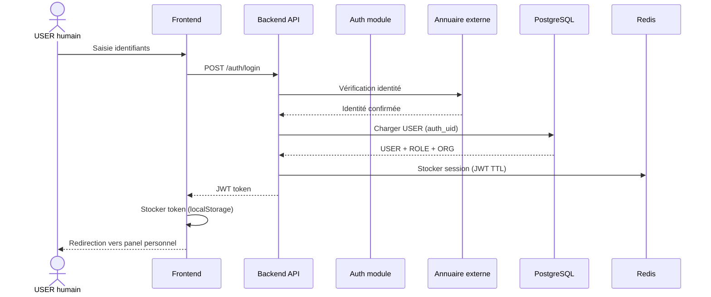
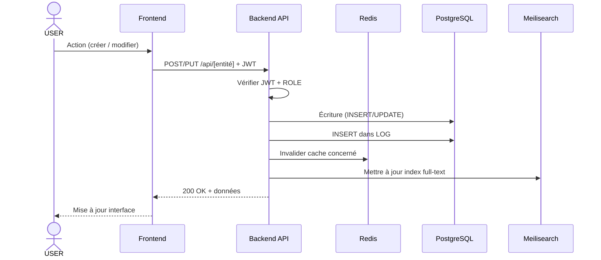
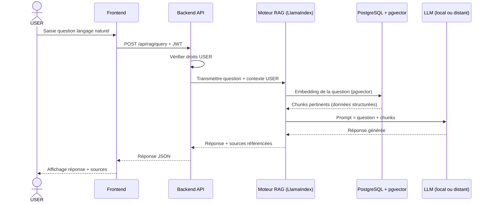
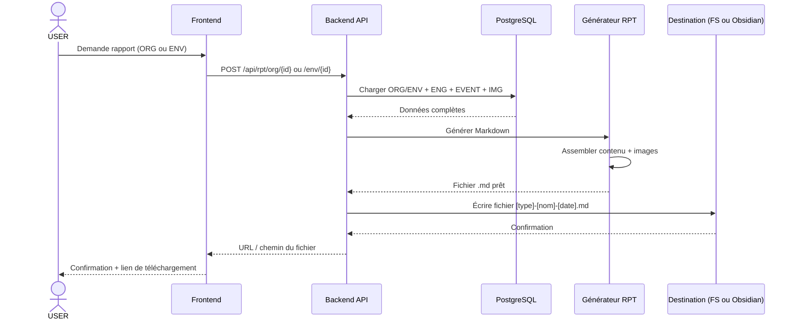
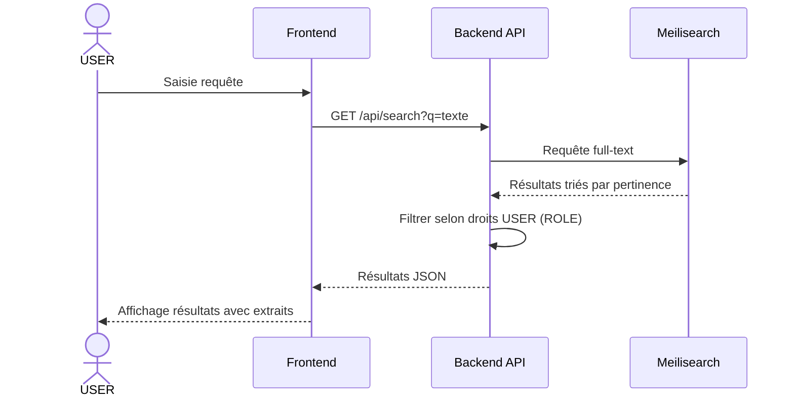
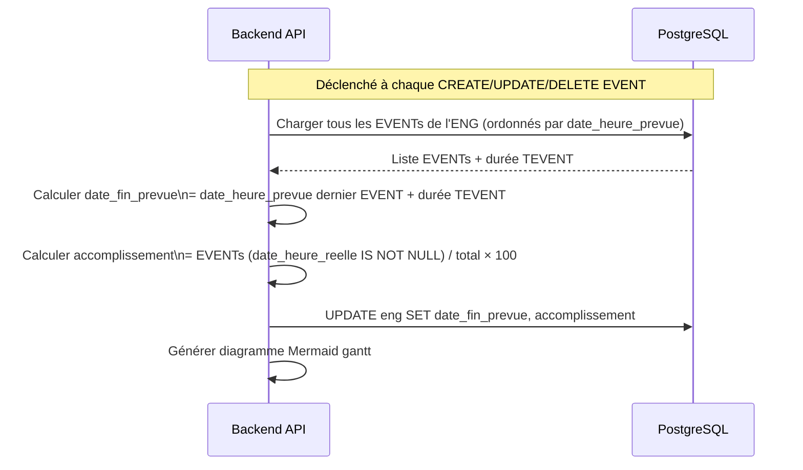
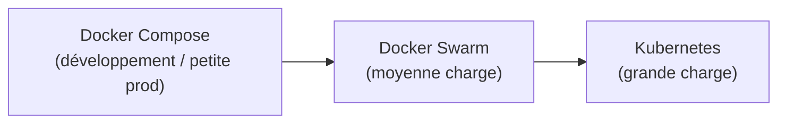

# Architecture système — be.CLEAR

## Vue d'ensemble

be.CLEAR suit une architecture **client-serveur découplée** :
- Un frontend SPA (Single Page Application) communique exclusivement via l'API REST
- Un backend expose l'API REST et orchestre tous les services
- Les services tiers (base de données, recherche, cache, LLM) sont isolés dans leurs propres containers Docker

---

## Diagramme 1 — Composants système

---

## Diagramme 2 — Déploiement Docker

be.CLEAR est **multi-instance** : plusieurs instances peuvent tourner en parallèle sur la même machine. Chaque instance est déployée avec `./deploy.sh --instance=<nom>`, qui passe `-p <nom>` à Docker Compose — containers, volumes et réseau sont préfixés automatiquement par ce nom.

> Chaque instance a son propre fichier `.env.<nom>` définissant des ports uniques sur l'hôte. Les communications internes (backend → db, backend → search, etc.) utilisent les noms de service Docker et ne dépendent pas des ports hôte.

### Variables d'environnement clés

| Variable | Service | Description |
|----------|---------|-------------|
| `DATABASE_URL` | backend | URL PostgreSQL (réseau interne) |
| `MEILISEARCH_URL` | backend | URL Meilisearch (réseau interne) |
| `REDIS_URL` | backend | URL Redis (réseau interne) |
| `OLLAMA_URL` | backend | URL instance Ollama partagée |
| `SECRET_KEY` | backend | Clé de signature JWT |
| `OBSIDIAN_VAULT_PATH` | backend | Chemin du vault Obsidian (volume monté) |
| `MEDIA_PATH` | backend | Répertoire de stockage images/docs |
| `PUBLIC_BASE_URL` | backend | URL publique du backend (rapports RPT) |
| `VITE_API_URL` | frontend | URL du backend appelé depuis le navigateur |
| `FRONTEND_PORT` | hôte | Port exposé du frontend (défaut : 3000) |
| `BACKEND_PORT` | hôte | Port exposé du backend (défaut : 8000) |
| `MEILI_PORT` | hôte | Port exposé de Meilisearch (défaut : 7700) |
| `REDIS_PORT` | hôte | Port exposé de Redis (défaut : 6379) |
| `POSTGRES_PORT` | hôte | Port exposé de PostgreSQL (défaut : 5432) |

---

## Initialisation automatique (Bootstrap)

Au démarrage de chaque instance, l'entrypoint du backend exécute automatiquement les étapes suivantes :

Le seed est **strictement idempotent** : chaque entité est créée uniquement si elle est absente. Les données existantes ne sont jamais modifiées. Ce comportement garantit qu'un redémarrage ou une mise à jour de l'instance ne casse pas une base déjà en production.

---

## Diagramme 3 — Flux d'authentification

---

## Diagramme 4 — Flux CRUD standard

---

## Diagramme 5 — Flux RAG (Terminal IA)

---

## Diagramme 6 — Flux Rapport d'activité (RPT)

---

## Diagramme 7 — Flux recherche full-text

---

## Diagramme 8 — Flux calcul Gantt ENG

---

## Stratégie de cache (Redis)

| Données cachées | TTL | Invalidation |
|----------------|-----|--------------|
| Session JWT utilisateur | 8h | Déconnexion ou expiration |
| Arborescence TORG complète | 1h | Toute modification TORG |
| Arborescence TENV complète | 1h | Toute modification TENV |
| PROP résolues d'une CLA | 2h | Modification CLA ou PROP |
| Résultats recherche fréquents | 10min | Toute modification OBJ |

---

## Sécurité

| Mesure | Description |
|--------|-------------|
| **JWT** | Authentification stateless, token signé, TTL 8h |
| **HTTPS** | Chiffrement en transit (TLS) |
| **RBAC** | Toutes les routes API vérifient le ROLE du USER |
| **Rate limiting** | Protection contre les abus sur l'API publique |
| **API Token** | Applications compagnon utilisent un token dédié lié à un USER |
| **Isolation Docker** | Chaque service dans son réseau interne, seul le frontend est exposé |

---

## Scalabilité

L'architecture est conçue pour évoluer :

- **PostgreSQL** : réplication, read replicas pour les requêtes lourdes
- **Meilisearch** : scalable horizontalement
- **Backend FastAPI** : stateless — plusieurs instances derrière un load balancer
- **Redis** : cluster si nécessaire
