# Terminal IA — Architecture RAG

## Vue d'ensemble

Le Terminal IA de be.CLEAR est une interface de type **RAG (Retrieval-Augmented Generation)** qui permet aux utilisateurs d'interroger les données du système en langage naturel. La réponse s'appuie sur des extraits de la base de données, sélectionnés par similarité sémantique, plutôt que sur la seule connaissance du modèle de langage.

**Périmètre** : données structurées uniquement — ORG, ENV, ENG, EVENT, OBJ, VALUE, PROP. Les documents (DOC) et images (IMG) sont exclus du RAG.

---

## Phase 1 — Préparation et indexation

Cette phase se déroule **à chaque création ou modification** d'une entité (ORG, ENV, ENG, EVENT). Elle n'est pas déclenchée par l'utilisateur du terminal : elle maintient l'index à jour en continu.

### 1.1 Déclenchement

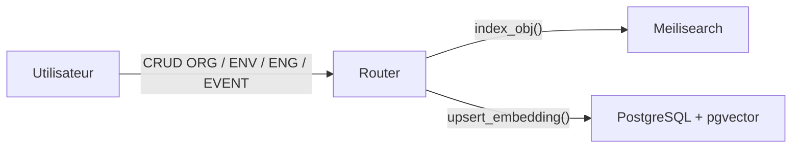

Les routeurs FastAPI (`routers/org.py`, `routers/env.py`, `routers/eng.py`, `routers/event.py`) appellent systématiquement deux services après chaque opération d'écriture :

| Service appelé | Fonction | Cible |
|---|---|---|
| `search_service.index_obj()` | Indexation plein texte | Meilisearch |
| `embedding_service.upsert_embedding()` | Vectorisation sémantique | PostgreSQL / pgvector |

### 1.2 Construction du texte d'indexation

Avant toute indexation, les deux services commencent par construire une représentation textuelle de l'entité via `build_embed_text()` (`embedding_service.py`) :

```
[ENTITY_TYPE] nom de l'entité
description en Markdown
valeur_prop_1 : valeur_prop_2 : ...
```

Ce texte concentre le contenu significatif de l'objet : son type, son nom, sa description et toutes ses valeurs de propriétés.

### 1.3 Indexation plein texte — Meilisearch

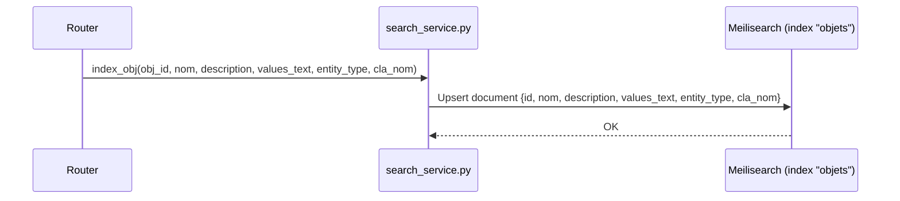

**Index Meilisearch `"objets"`**

| Paramètre | Valeur |
|---|---|
| Clé primaire | `id` |
| Attributs recherchables | `nom`, `description`, `values_text`, `cla_nom` |
| Attributs filtrables | `entity_type`, `cla_nom` |
| Highlights | `nom`, `description` (balises `<em>`) |

Meilisearch est utilisé pour la **recherche full-text** accessible depuis la barre de recherche globale (`GET /api/search?q=...`). Il n'intervient **pas** dans le pipeline RAG du terminal IA.

### 1.4 Vectorisation sémantique — pgvector

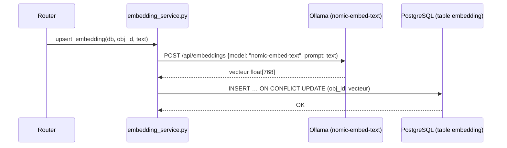

**Modèle d'embedding** : `nomic-embed-text` via Ollama  
**Dimension** : 768 flottants  
**Métrique** : distance cosinus (`<=>` pgvector)  
**Index** : HNSW — `m=16`, `ef_construction=64` (recherche approchée rapide)

**Schéma de la table `embedding`**

```sql
CREATE TABLE embedding (
    id         SERIAL PRIMARY KEY,
    obj_id     INTEGER UNIQUE NOT NULL REFERENCES obj(id) ON DELETE CASCADE,
    vecteur    vector(768),
    created_at TIMESTAMP,
    updated_at TIMESTAMP
);

CREATE INDEX ON embedding USING hnsw (vecteur vector_cosine_ops)
WITH (m = 16, ef_construction = 64);
```

Chaque `obj` ne possède qu'**un seul vecteur** (relation 1-1). La suppression d'un `obj` entraîne la suppression en cascade de son vecteur.

### 1.5 Vue synthétique de la double indexation

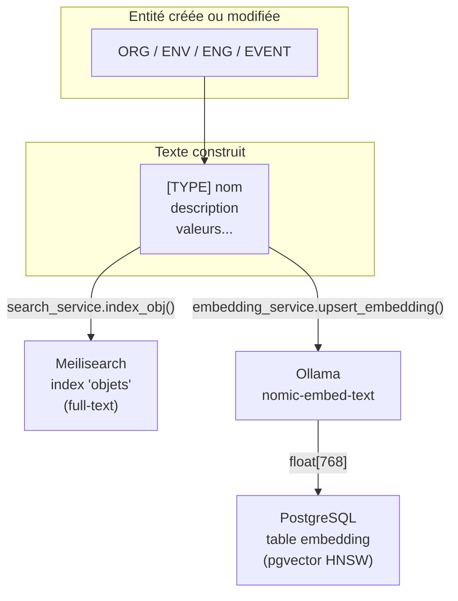

---

## Phase 2 — Traitement d'une requête utilisateur

### Vue d'ensemble du pipeline

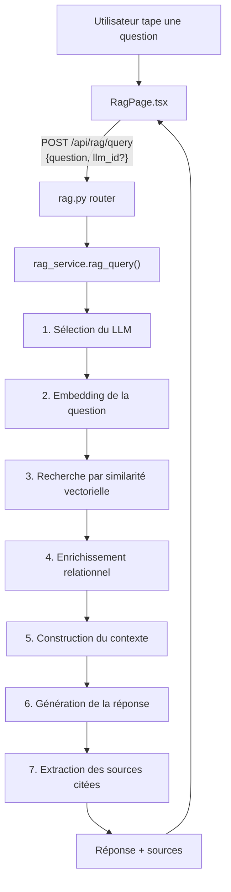

---

### Étape 1 — Sélection du LLM

`list_available_llms(db)` (`rag_service.py`) interroge la table `llm_config` et détermine le modèle à utiliser :

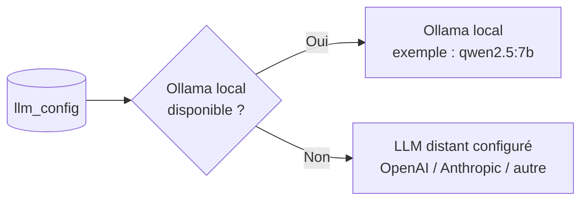

- Si l'utilisateur spécifie un `llm_id` dans sa requête, ce modèle est utilisé en priorité.
- Sinon, le système favorise Ollama (économie de tokens, confidentialité).
- La configuration des LLM distants est gérée par un ADMIN via `GET/POST /api/config/llm`.

---

### Étape 2 — Embedding de la question

`embed_text(question)` (`embedding_service.py`) transforme la question en vecteur.

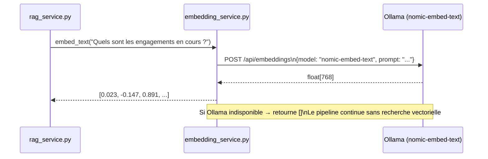

Le vecteur produit est dans le **même espace sémantique** que les vecteurs stockés dans `embedding` — condition nécessaire pour que la similarité cosinus soit significative.

---

### Étape 3 — Recherche par similarité vectorielle

`similarity_search(db, query_vec, top_k=8)` (`rag_service.py`) identifie les entités les plus proches sémantiquement de la question.

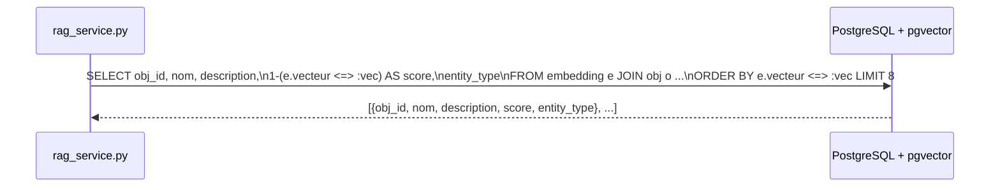

**Requête SQL simplifiée :**

```sql
SELECT
    e.obj_id,
    o.nom,
    o.description,
    1 - (e.vecteur <=> CAST(:vec AS vector)) AS score,
    CASE
        WHEN EXISTS (SELECT 1 FROM org WHERE obj_id = e.obj_id) THEN 'org'
        WHEN EXISTS (SELECT 1 FROM env WHERE obj_id = e.obj_id) THEN 'env'
        WHEN EXISTS (SELECT 1 FROM eng WHERE obj_id = e.obj_id) THEN 'eng'
        WHEN EXISTS (SELECT 1 FROM event WHERE obj_id = e.obj_id) THEN 'event'
        ELSE 'obj'
    END AS entity_type
FROM embedding e
JOIN obj o ON o.id = e.obj_id
WHERE e.vecteur IS NOT NULL
ORDER BY e.vecteur <=> CAST(:vec AS vector)
LIMIT :k
```

| Paramètre | Valeur |
|---|---|
| Opérateur | `<=>` (distance cosinus pgvector) |
| Score | `1 - distance` → 0 (dissimilaire) à 1 (identique) |
| Top-k | 8 résultats |
| Index utilisé | HNSW (recherche approchée, très rapide) |

---

### Étape 4 — Enrichissement relationnel

`_enrich_sources(db, sources)` (`rag_service.py`) complète chaque résultat avec son graphe relationnel.

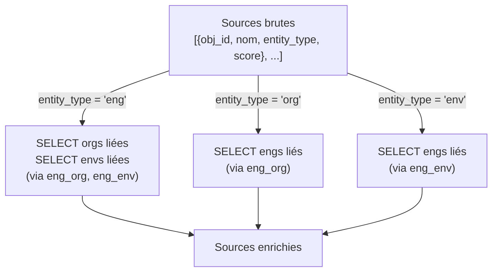

Exemple de source enrichie :

```json
{
  "obj_id": 42,
  "nom": "Déploiement v2.0",
  "entity_type": "eng",
  "score": 0.87,
  "orgs": ["Mairie de Lyon"],
  "envs": ["Production"]
}
```

---

### Étape 5 — Construction du contexte

`_build_context(sources)` (`rag_service.py`) formate les sources enrichies en texte numéroté pour le LLM.

```
SOURCE 1 [ENG] Déploiement v2.0
Description : Migration vers la version 2.0 de la plateforme.
ORGs liées : Mairie de Lyon
ENVs liées : Production

SOURCE 2 [ORG] Mairie de Lyon
Description : Collectivité territoriale, 500 000 habitants.
ENGs liés : Déploiement v2.0, Formation agents

SOURCE 3 [ENV] Production
Description : Environnement de production principal.
ENGs liés : Déploiement v2.0
...
```

Ce format numéroté permet au LLM de citer précisément ses sources (`SOURCES_USED: 1, 3`).

---

### Étape 6 — Génération de la réponse

`_generate(question, context, llm_config)` (`rag_service.py`) envoie la question et le contexte au LLM sélectionné.

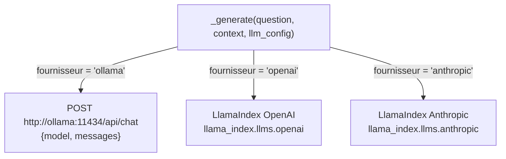

**Prompt système envoyé au LLM :**

```
Tu es un assistant expert en analyse de données de be.CLEAR.
Réponds en français.
Appuie-toi UNIQUEMENT sur les sources fournies.
À la fin de ta réponse, indique les numéros des sources utilisées
sous la forme : SOURCES_USED: 1,3,5
```

**Message utilisateur :**

```
CONTEXTE :
[texte des sources numérotées]

QUESTION : Quels sont les engagements en cours avec la Mairie de Lyon ?
```

---

### Étape 7 — Extraction des sources citées

`rag_query()` (`rag_service.py`) parse la réponse brute du LLM pour identifier les sources effectivement utilisées.

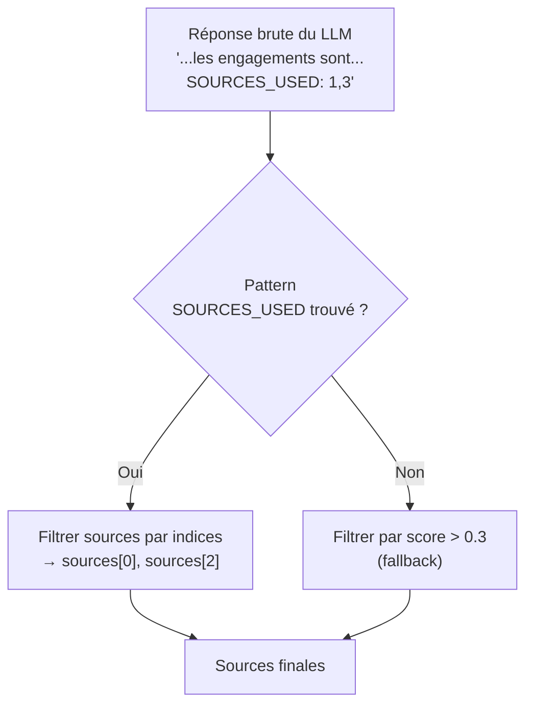

---

### Vue de séquence complète

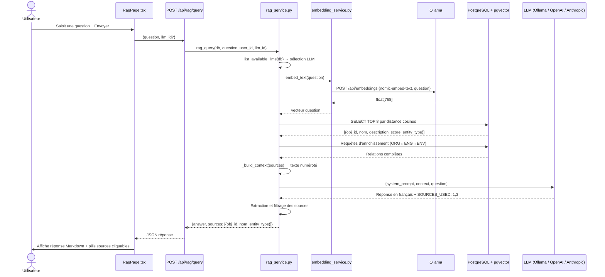

---

## Architecture des composants

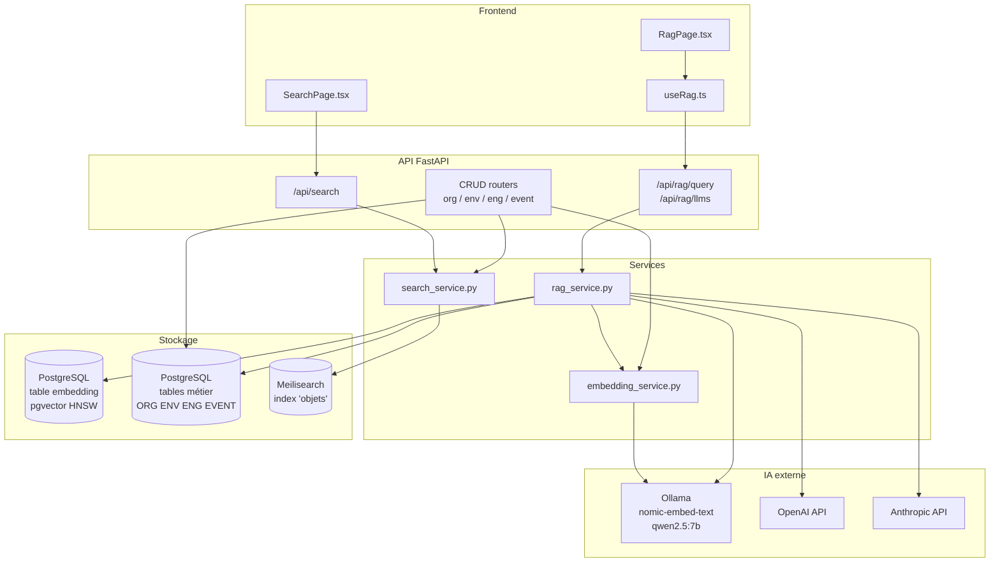

---

## Configuration technique

| Paramètre | Valeur | Fichier |
|---|---|---|
| Modèle d'embedding | `nomic-embed-text` | `config.py` → `OLLAMA_EMBED_MODEL` |
| Dimension vecteur | 768 | `config.py` → `OLLAMA_EMBED_DIM` |
| Modèle LLM local | `qwen2.5:7b` | `config.py` → `OLLAMA_LLM_MODEL` |
| URL Ollama | `http://100.72.122.51:11434` | `config.py` → `OLLAMA_URL` |
| URL Meilisearch | `http://search:7700` | `config.py` → `MEILISEARCH_URL` |
| Top-k vectoriel | 8 | `rag_service.py` |
| Seuil score fallback | 0.3 | `rag_service.py` |
| Index HNSW m | 16 | migration `0002` |
| Index HNSW ef_construction | 64 | migration `0002` |

---

## Fichiers clés

| Fichier | Rôle |
|---|---|
| `backend/app/services/rag_service.py` | Pipeline RAG complet (embedding → recherche → génération) |
| `backend/app/services/embedding_service.py` | Vectorisation via Ollama, upsert pgvector |
| `backend/app/services/search_service.py` | Indexation et recherche Meilisearch |
| `backend/app/routers/rag.py` | Endpoints `/api/rag/query` et `/api/rag/llms` |
| `backend/app/routers/search.py` | Endpoint `/api/search` |
| `backend/app/routers/org.py` (et env, eng, event) | Déclenchement double indexation sur CRUD |
| `backend/app/models/object.py` | Modèle `Embedding` (table pgvector) |
| `backend/app/models/system.py` | Modèle `LlmConfig` (configuration LLM) |
| `backend/alembic/versions/0002_embedding_768.py` | Migration : vecteur 768 dims + index HNSW |
| `frontend/src/pages/rag/RagPage.tsx` | Interface utilisateur du terminal IA |
| `frontend/src/hooks/useRag.ts` | Hooks React Query pour le RAG |
