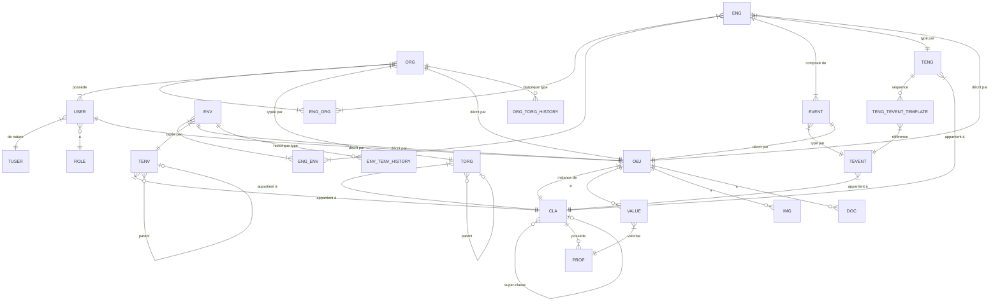

# Modèle de données — be.CLEAR

## Principes

- Base de données **PostgreSQL** avec extension **pgvector**
- Schéma normalisé (3NF) avec dénormalisations ciblées pour la performance
- Chaque entité métier possède une table propre
- Les métadonnées système (`created_at`, `updated_at`, `created_by`, `updated_by`) sont présentes sur toutes les tables sauf LOG
- Les suppressions ne sont pas physiques — elles sont tracées dans **LOG**
- Les VALUE utilisent des **colonnes typées hybrides** (Option C) — voir table `value`

---

## Schéma global

---

## Tables — Partie Activité

### `torg` — Types d'Organisation
Structure arborescente auto-référencée.

| Colonne | Type | Contraintes | Description |
|---------|------|-------------|-------------|
| `id` | SERIAL | PK | |
| `nom` | VARCHAR(255) | NOT NULL | |
| `parent_id` | INT | FK → torg(id), NULL | NULL = nœud racine |
| `chemin` | TEXT | | **Dénormalisé** — chemin complet ex : `Entreprises/PME` |
| `cla_id` | INT | FK → cla(id), NOT NULL | Détermine les PROP des ORG de ce type |
| `created_at` | TIMESTAMPTZ | NOT NULL | |
| `updated_at` | TIMESTAMPTZ | NOT NULL | |
| `created_by` | INT | FK → user(id) | |
| `updated_by` | INT | FK → user(id) | |

> `chemin` est dénormalisé pour éviter les requêtes récursives lors de l'affichage de l'arborescence.

---

### `tenv` — Types d'Environnement
Structure identique à `torg`.

| Colonne | Type | Contraintes | Description |
|---------|------|-------------|-------------|
| `id` | SERIAL | PK | |
| `nom` | VARCHAR(255) | NOT NULL | |
| `parent_id` | INT | FK → tenv(id), NULL | |
| `chemin` | TEXT | | **Dénormalisé** |
| `cla_id` | INT | FK → cla(id), NOT NULL | |
| `created_at` | TIMESTAMPTZ | NOT NULL | |
| `updated_at` | TIMESTAMPTZ | NOT NULL | |
| `created_by` | INT | FK → user(id) | |
| `updated_by` | INT | FK → user(id) | |

---

### `teng` — Types d'Engagement
Liste plate.

| Colonne | Type | Contraintes | Description |
|---------|------|-------------|-------------|
| `id` | SERIAL | PK | |
| `nom` | VARCHAR(255) | NOT NULL | |
| `cla_id` | INT | FK → cla(id), NOT NULL | |
| `created_at` | TIMESTAMPTZ | NOT NULL | |
| `updated_at` | TIMESTAMPTZ | NOT NULL | |
| `created_by` | INT | FK → user(id) | |
| `updated_by` | INT | FK → user(id) | |

---

### `teng_tevent_template` — Séquence de TEVENTs d'un TENG
Liste ordonnée de TEVENT à créer automatiquement à la création d'un ENG de ce type.

| Colonne | Type | Contraintes | Description |
|---------|------|-------------|-------------|
| `id` | SERIAL | PK | |
| `teng_id` | INT | FK → teng(id) CASCADE, NOT NULL | |
| `tevent_id` | INT | FK → tevent(id) CASCADE, NOT NULL | |
| `ordre` | INT | NOT NULL, DEFAULT 0 | Position dans la séquence (0-based) |
| `created_at` | TIMESTAMPTZ | NOT NULL | |
| `updated_at` | TIMESTAMPTZ | NOT NULL | |
| `created_by` | INT | FK → user(id) | |
| `updated_by` | INT | FK → user(id) | |

Contrainte : `UNIQUE(teng_id, ordre)` — deux entrées d'un même TENG ne peuvent avoir le même rang.

> Lors de la création d'un ENG, si son TENG possède des entrées dans cette table et que `date_début` est renseignée, les EVENTs sont générés en cascade : chaque EVENT démarre à la fin du précédent (`date_heure_prévue + durée TEVENT`).

---

### `tevent` — Types d'Évènement
Liste plate avec durée par défaut.

| Colonne | Type | Contraintes | Description |
|---------|------|-------------|-------------|
| `id` | SERIAL | PK | |
| `nom` | VARCHAR(255) | NOT NULL | |
| `duree_valeur` | DECIMAL | | Durée prévue par défaut |
| `duree_unite` | VARCHAR(20) | | `secondes`, `minutes`, `heures`, `jours`, `mois` |
| `cla_id` | INT | FK → cla(id), NOT NULL | |
| `created_at` | TIMESTAMPTZ | NOT NULL | |
| `updated_at` | TIMESTAMPTZ | NOT NULL | |
| `created_by` | INT | FK → user(id) | |
| `updated_by` | INT | FK → user(id) | |

---

### `tuser` — Types d'Utilisateur
Liste plate — classificateur de nature uniquement.

| Colonne | Type | Contraintes | Description |
|---------|------|-------------|-------------|
| `id` | SERIAL | PK | |
| `nom` | VARCHAR(100) | NOT NULL | `humain`, `système`, `cron`, `IA`... |
| `est_humain` | BOOLEAN | NOT NULL, DEFAULT false | Détermine le rattachement ORG et ROLE |
| `created_at` | TIMESTAMPTZ | NOT NULL | |
| `updated_at` | TIMESTAMPTZ | NOT NULL | |
| `created_by` | INT | FK → user(id) | |
| `updated_by` | INT | FK → user(id) | |

---

### `role` — Rôles
Table de référence fixe (3 enregistrements).

| Colonne | Type | Contraintes | Description |
|---------|------|-------------|-------------|
| `id` | SERIAL | PK | |
| `code` | VARCHAR(20) | NOT NULL, UNIQUE | `ADMIN`, `EDITEUR`, `LECTEUR` |
| `libelle` | VARCHAR(100) | NOT NULL | |
| `description` | TEXT | | |

---

### `org` — Organisations

| Colonne | Type | Contraintes | Description |
|---------|------|-------------|-------------|
| `id` | SERIAL | PK | |
| `torg_id` | INT | FK → torg(id), NOT NULL | Type courant |
| `obj_id` | INT | FK → obj(id), NOT NULL, UNIQUE | |
| `created_at` | TIMESTAMPTZ | NOT NULL | |
| `updated_at` | TIMESTAMPTZ | NOT NULL | |
| `created_by` | INT | FK → user(id) | |
| `updated_by` | INT | FK → user(id) | |

---

### `org_torg_history` — Historique des types d'ORG

| Colonne | Type | Contraintes | Description |
|---------|------|-------------|-------------|
| `id` | SERIAL | PK | |
| `org_id` | INT | FK → org(id), NOT NULL | |
| `torg_id` | INT | FK → torg(id), NOT NULL | |
| `date_debut` | TIMESTAMPTZ | NOT NULL | |
| `date_fin` | TIMESTAMPTZ | NULL | NULL = période en cours |
| `created_by` | INT | FK → user(id) | |

---

### `env` — Environnements

| Colonne | Type | Contraintes | Description |
|---------|------|-------------|-------------|
| `id` | SERIAL | PK | |
| `tenv_id` | INT | FK → tenv(id), NOT NULL | Type courant |
| `obj_id` | INT | FK → obj(id), NOT NULL, UNIQUE | |
| `created_at` | TIMESTAMPTZ | NOT NULL | |
| `updated_at` | TIMESTAMPTZ | NOT NULL | |
| `created_by` | INT | FK → user(id) | |
| `updated_by` | INT | FK → user(id) | |

---

### `env_tenv_history` — Historique des types d'ENV
Structure identique à `org_torg_history`.

| Colonne | Type | Contraintes | Description |
|---------|------|-------------|-------------|
| `id` | SERIAL | PK | |
| `env_id` | INT | FK → env(id), NOT NULL | |
| `tenv_id` | INT | FK → tenv(id), NOT NULL | |
| `date_debut` | TIMESTAMPTZ | NOT NULL | |
| `date_fin` | TIMESTAMPTZ | NULL | NULL = période en cours |
| `created_by` | INT | FK → user(id) | |

---

### `eng` — Engagements

| Colonne | Type | Contraintes | Description |
|---------|------|-------------|-------------|
| `id` | SERIAL | PK | |
| `teng_id` | INT | FK → teng(id), NOT NULL | |
| `obj_id` | INT | FK → obj(id), NOT NULL, UNIQUE | |
| `date_debut` | TIMESTAMPTZ | | |
| `date_debut_prevue` | TIMESTAMPTZ | | |
| `date_fin` | TIMESTAMPTZ | | |
| `date_fin_prevue` | TIMESTAMPTZ | | **Dénormalisé** — calculé à partir des EVENTs |
| `accomplissement` | DECIMAL(5,2) | | **Dénormalisé** — % calculé à partir des EVENTs |
| `created_at` | TIMESTAMPTZ | NOT NULL | |
| `updated_at` | TIMESTAMPTZ | NOT NULL | |
| `created_by` | INT | FK → user(id) | |
| `updated_by` | INT | FK → user(id) | |

> `date_fin_prevue` et `accomplissement` sont dénormalisés et recalculés à chaque modification d'un EVENT.

---

### `eng_org` — Jonction Engagement ↔ Organisation

| Colonne | Type | Contraintes | Description |
|---------|------|-------------|-------------|
| `eng_id` | INT | FK → eng(id), NOT NULL | |
| `org_id` | INT | FK → org(id), NOT NULL | |
| | | PK(eng_id, org_id) | |

---

### `eng_env` — Jonction Engagement ↔ Environnement

| Colonne | Type | Contraintes | Description |
|---------|------|-------------|-------------|
| `eng_id` | INT | FK → eng(id), NOT NULL | |
| `env_id` | INT | FK → env(id), NOT NULL | |
| | | PK(eng_id, env_id) | |

---

### `event` — Évènements

| Colonne | Type | Contraintes | Description |
|---------|------|-------------|-------------|
| `id` | SERIAL | PK | |
| `eng_id` | INT | FK → eng(id), NOT NULL | |
| `tevent_id` | INT | FK → tevent(id), NOT NULL | |
| `obj_id` | INT | FK → obj(id), NOT NULL, UNIQUE | |
| `date_heure_prevue` | TIMESTAMPTZ | NOT NULL | Date planifiée — détermine l'ordre dans l'ENG |
| `date_heure_reelle` | TIMESTAMPTZ | NULL | Date effective — NULL jusqu'à réalisation — renseigner = marquer accompli |
| `duree_reelle_valeur` | DECIMAL | | Durée effective (peut différer de TEVENT) |
| `duree_reelle_unite` | VARCHAR(20) | | |
| `created_at` | TIMESTAMPTZ | NOT NULL | |
| `updated_at` | TIMESTAMPTZ | NOT NULL | |
| `created_by` | INT | FK → user(id) | |
| `updated_by` | INT | FK → user(id) | |

---

### `user` — Utilisateurs / Acteurs

| Colonne | Type | Contraintes | Description |
|---------|------|-------------|-------------|
| `id` | SERIAL | PK | |
| `tuser_id` | INT | FK → tuser(id), NOT NULL | |
| `role_id` | INT | FK → role(id), NULL | NULL pour USER non-humains |
| `org_id` | INT | FK → org(id), NULL | NULL pour USER non-humains |
| `obj_id` | INT | FK → obj(id), NOT NULL, UNIQUE | |
| `auth_provider` | VARCHAR(100) | | LDAP, OAuth... (humains uniquement) |
| `auth_uid` | VARCHAR(255) | | Identifiant dans l'annuaire externe |
| `created_at` | TIMESTAMPTZ | NOT NULL | |
| `updated_at` | TIMESTAMPTZ | NOT NULL | |
| `created_by` | INT | FK → user(id) | |
| `updated_by` | INT | FK → user(id) | |

---

## Tables — Partie Objet

### `cla` — Classes

| Colonne | Type | Contraintes | Description |
|---------|------|-------------|-------------|
| `id` | SERIAL | PK | |
| `nom` | VARCHAR(255) | NOT NULL | |
| `super_cla_id` | INT | FK → cla(id), NULL | NULL = classe racine |
| `comportement` | TEXT | | Texte Markdown |
| `visuel_type` | VARCHAR(10) | | `icone` ou `image` |
| `visuel_valeur` | TEXT | | Nom de l'icône ou chemin de l'image |
| `props_resolues` | JSONB | | **Dénormalisé** — PROP propres + héritées |
| `created_at` | TIMESTAMPTZ | NOT NULL | |
| `updated_at` | TIMESTAMPTZ | NOT NULL | |
| `created_by` | INT | FK → user(id) | |
| `updated_by` | INT | FK → user(id) | |

> `props_resolues` est un cache JSONB de toutes les PROP (propres + héritées de la chaîne) pour éviter les jointures récursives à la lecture.

---

### `prop` — Propriétés

| Colonne | Type | Contraintes | Description |
|---------|------|-------------|-------------|
| `id` | SERIAL | PK | |
| `cla_id` | INT | FK → cla(id), NOT NULL | Classe propriétaire |
| `nom` | VARCHAR(255) | NOT NULL | |
| `type` | VARCHAR(20) | NOT NULL | Voir liste des types ci-dessous |
| `liste_valeurs` | JSONB | | Pour type `LISTE` — valeurs possibles |
| `created_at` | TIMESTAMPTZ | NOT NULL | |
| `updated_at` | TIMESTAMPTZ | NOT NULL | |
| `created_by` | INT | FK → user(id) | |
| `updated_by` | INT | FK → user(id) | |

**Types de PROP (`type`) :**
`DATE`, `HEURE`, `DATETIME`, `DUREE`, `TEXTE`, `MARKDOWN`, `ENTIER`, `DECIMAL`, `MONTANT`, `POURCENTAGE`, `BOOLEEN`, `LISTE`, `URL`, `EMAIL`, `TELEPHONE`, `IMAGEURL`, `REFERENCE`, `COORDONNEES`

---

### `obj` — Objets

| Colonne | Type | Contraintes | Description |
|---------|------|-------------|-------------|
| `id` | SERIAL | PK | |
| `uid` | UUID | NOT NULL, UNIQUE, DEFAULT gen_random_uuid() | Identifiant universel |
| `cla_id` | INT | FK → cla(id), NOT NULL | |
| `nom` | VARCHAR(500) | NOT NULL | |
| `description` | TEXT | | Markdown |
| `search_vector` | TSVECTOR | | **Dénormalisé** — index full-text (nom + description + VALUES textuelles) |
| `created_at` | TIMESTAMPTZ | NOT NULL | |
| `updated_at` | TIMESTAMPTZ | NOT NULL | |
| `created_by` | INT | FK → user(id) | |
| `updated_by` | INT | FK → user(id) | |

> `search_vector` est mis à jour via trigger PostgreSQL à chaque modification de `nom`, `description` ou des `value` textuelles associées.

---

### `value` — Valeurs

Stratégie **colonnes typées hybrides** : seule la colonne correspondant au type de la PROP est renseignée, les autres sont NULL.

| Colonne | Type PostgreSQL | Contraintes | Types PROP concernés |
|---------|----------------|-------------|----------------------|
| `id` | SERIAL | PK | |
| `obj_id` | INT | FK → obj(id), NOT NULL | |
| `prop_id` | INT | FK → prop(id), NOT NULL | |
| `valeur_texte` | TEXT | | `TEXTE`, `MARKDOWN`, `URL`, `EMAIL`, `TELEPHONE`, `IMAGEURL`, `LISTE` |
| `valeur_date` | TIMESTAMPTZ | | `DATE`, `HEURE`, `DATETIME` |
| `valeur_nombre` | DECIMAL(20,6) | | `ENTIER`, `DECIMAL`, `POURCENTAGE`, `MONTANT` (en CHF) |
| `valeur_bool` | BOOLEAN | | `BOOLEEN` |
| `valeur_json` | JSONB | | `DUREE` `{valeur, unite}`, `COORDONNEES` `{lat, lng}` |
| `valeur_ref_obj_id` | INT | FK → obj(id) | `REFERENCE` |
| | | UNIQUE(obj_id, prop_id) | 1 VALUE par PROP par OBJ |
| `created_at` | TIMESTAMPTZ | NOT NULL | |
| `updated_at` | TIMESTAMPTZ | NOT NULL | |
| `created_by` | INT | FK → user(id) | |
| `updated_by` | INT | FK → user(id) | |

**Exemples de stockage :**

| Type PROP | Colonne utilisée | Exemple de valeur |
|-----------|-----------------|-------------------|
| `DATE` | `valeur_date` | `2025-06-15 00:00:00+00` |
| `HEURE` | `valeur_date` | `2025-01-01 09:30:00+00` |
| `DATETIME` | `valeur_date` | `2025-06-15 14:30:00+02` |
| `TEXTE` | `valeur_texte` | `"Acme Corporation"` |
| `MARKDOWN` | `valeur_texte` | `"## Présentation\n..."` |
| `ENTIER` | `valeur_nombre` | `42.000000` |
| `DECIMAL` | `valeur_nombre` | `3.141593` |
| `POURCENTAGE` | `valeur_nombre` | `85.500000` |
| `MONTANT` | `valeur_nombre` | `1500.000000` (CHF) |
| `DUREE` | `valeur_json` | `{"valeur": 2, "unite": "jours"}` |
| `COORDONNEES` | `valeur_json` | `{"lat": 48.8566, "lng": 2.3522}` |
| `BOOLEEN` | `valeur_bool` | `true` |
| `LISTE` | `valeur_texte` | `"Actif"` |
| `URL` | `valeur_texte` | `"https://acme.com"` |
| `EMAIL` | `valeur_texte` | `"contact@acme.com"` |
| `TELEPHONE` | `valeur_texte` | `"+33612345678"` |
| `IMAGEURL` | `valeur_texte` | `"https://acme.com/logo.png"` (affiché en image) |
| `REFERENCE` | `valeur_ref_obj_id` | `42` (id OBJ cible) |

---

### `img` — Images

| Colonne | Type | Contraintes | Description |
|---------|------|-------------|-------------|
| `id` | SERIAL | PK | |
| `obj_id` | INT | FK → obj(id), NOT NULL | |
| `nom` | VARCHAR(255) | NOT NULL | |
| `chemin` | TEXT | NOT NULL | Chemin de stockage |
| `mime_type` | VARCHAR(100) | | |
| `est_principale` | BOOLEAN | NOT NULL, DEFAULT false | |
| `created_at` | TIMESTAMPTZ | NOT NULL | |
| `updated_at` | TIMESTAMPTZ | NOT NULL | |
| `created_by` | INT | FK → user(id) | |
| `updated_by` | INT | FK → user(id) | |

---

### `doc` — Documents

| Colonne | Type | Contraintes | Description |
|---------|------|-------------|-------------|
| `id` | SERIAL | PK | |
| `obj_id` | INT | FK → obj(id), NOT NULL | |
| `nom` | VARCHAR(255) | NOT NULL | |
| `chemin` | TEXT | NOT NULL | Chemin de stockage |
| `format` | VARCHAR(20) | NOT NULL | `markdown`, `word`, `excel`, `powerpoint` |
| `mime_type` | VARCHAR(100) | | |
| `created_at` | TIMESTAMPTZ | NOT NULL | |
| `updated_at` | TIMESTAMPTZ | NOT NULL | |
| `created_by` | INT | FK → user(id) | |
| `updated_by` | INT | FK → user(id) | |

---

## Tables Système et Configuration

### `config` — Configuration globale

| Colonne | Type | Contraintes | Description |
|---------|------|-------------|-------------|
| `id` | SERIAL | PK | Toujours 1 enregistrement unique |
| `obsidian_vault_path` | TEXT | | Chemin vers le vault Obsidian |
| `updated_at` | TIMESTAMPTZ | NOT NULL | |
| `updated_by` | INT | FK → user(id) | |

---

### `llm_config` — Configuration des LLM

| Colonne | Type | Contraintes | Description |
|---------|------|-------------|-------------|
| `id` | SERIAL | PK | |
| `nom` | VARCHAR(100) | NOT NULL | Nom d'affichage |
| `type` | VARCHAR(10) | NOT NULL | `distant` ou `local` |
| `fournisseur` | VARCHAR(50) | | `claude`, `openai`, `ollama`... |
| `url` | TEXT | | URL de l'API (local ou distant) |
| `modele` | VARCHAR(100) | | Nom du modèle |
| `api_key` | TEXT | | Clé API chiffrée (distants uniquement) |
| `actif` | BOOLEAN | NOT NULL, DEFAULT true | |
| `created_at` | TIMESTAMPTZ | NOT NULL | |
| `updated_at` | TIMESTAMPTZ | NOT NULL | |
| `created_by` | INT | FK → user(id) | |
| `updated_by` | INT | FK → user(id) | |

---

### `api_token` — Tokens d'accès API externe

| Colonne | Type | Contraintes | Description |
|---------|------|-------------|-------------|
| `id` | SERIAL | PK | |
| `user_id` | INT | FK → user(id), NOT NULL | USER associé (détermine les droits ROLE) |
| `token_hash` | VARCHAR(255) | NOT NULL, UNIQUE | Hash du token (jamais stocké en clair) |
| `nom` | VARCHAR(100) | NOT NULL | Libellé descriptif |
| `expire_at` | TIMESTAMPTZ | NULL | NULL = pas d'expiration |
| `derniere_utilisation` | TIMESTAMPTZ | | |
| `actif` | BOOLEAN | NOT NULL, DEFAULT true | |
| `created_at` | TIMESTAMPTZ | NOT NULL | |
| `created_by` | INT | FK → user(id) | |

---

### `embedding` — Vecteurs pour le RAG

| Colonne | Type | Contraintes | Description |
|---------|------|-------------|-------------|
| `id` | SERIAL | PK | |
| `obj_id` | INT | FK → obj(id), NOT NULL, UNIQUE | OBJ vectorisé |
| `vecteur` | VECTOR(1536) | NOT NULL | Embedding pgvector (dimension selon le modèle) |
| `updated_at` | TIMESTAMPTZ | NOT NULL | Date de calcul du vecteur |

> La dimension (1536) est celle d'OpenAI `text-embedding-ada-002`. À adapter selon le modèle d'embedding utilisé (Ollama : variable selon modèle).

---

### `log` — Journal des opérations

| Colonne | Type | Contraintes | Description |
|---------|------|-------------|-------------|
| `id` | BIGSERIAL | PK | |
| `operation` | VARCHAR(10) | NOT NULL | `CREATE`, `UPDATE`, `DELETE` |
| `table_nom` | VARCHAR(100) | NOT NULL | Nom de la table concernée |
| `entite_id` | INT | NOT NULL | ID de l'enregistrement concerné |
| `user_id` | INT | FK → user(id) | Acteur (humain ou non-humain) |
| `timestamp` | TIMESTAMPTZ | NOT NULL, DEFAULT NOW() | |
| `avant` | JSONB | | État avant l'opération |
| `apres` | JSONB | | État après l'opération |

---

## Stratégies de dénormalisation

| Champ dénormalisé | Table | Justification |
|-------------------|-------|---------------|
| `chemin` | `torg`, `tenv` | Évite les requêtes récursives pour l'affichage de l'arborescence |
| `date_fin_prevue`, `accomplissement` | `eng` | Calcul coûteux sur les EVENTs — mis en cache et recalculé à chaque modification |
| `props_resolues` | `cla` | Évite la traversée de la chaîne d'héritage à chaque lecture d'un OBJ |
| `search_vector` | `obj` | Index full-text PostgreSQL — mis à jour par trigger |

---

## Index recommandés

| Table | Colonne(s) | Type | Justification |
|-------|-----------|------|---------------|
| `obj` | `search_vector` | GIN | Recherche full-text |
| `obj` | `uid` | BTREE UNIQUE | Accès par UUID universel |
| `obj` | `cla_id` | BTREE | Filtrage par classe — migration 0012 |
| `value` | `(obj_id, prop_id)` | BTREE UNIQUE | Unicité + jointures |
| `value` | `prop_id` | BTREE | CASCADE DELETE sur PROP — migration 0012 |
| `value` | `valeur_ref_obj_id` | BTREE | Navigation par REFERENCE |
| `value` | `valeur_date` | BTREE | Filtrage et tri par date |
| `value` | `valeur_nombre` | BTREE | Filtrage et tri numérique |
| `value` | `valeur_texte` | GIN (trgm) | Recherche partielle sur valeurs textuelles |
| `value` | `valeur_json` | GIN | Filtrage sur MONTANT, DUREE, COORDONNEES |
| `event` | `(eng_id, date_heure_prevue)` | BTREE | Tri séquentiel des EVENTs |
| `event` | `date_heure_reelle` | BTREE | Filtrage EVENTs accomplis |
| `torg` | `parent_id` | BTREE | Navigation arborescente |
| `tenv` | `parent_id` | BTREE | Navigation arborescente |
| `cla` | `super_cla_id` | BTREE | Traversée de l'héritage |
| `log` | `(table_nom, entite_id)` | BTREE | Consultation de l'historique |
| `log` | `timestamp` | BTREE | Tri chronologique |
| `org_torg_history` | `(org_id, date_fin)` | BTREE | Type courant (date_fin IS NULL) |
| `env_tenv_history` | `(env_id, date_fin)` | BTREE | Type courant (date_fin IS NULL) |
