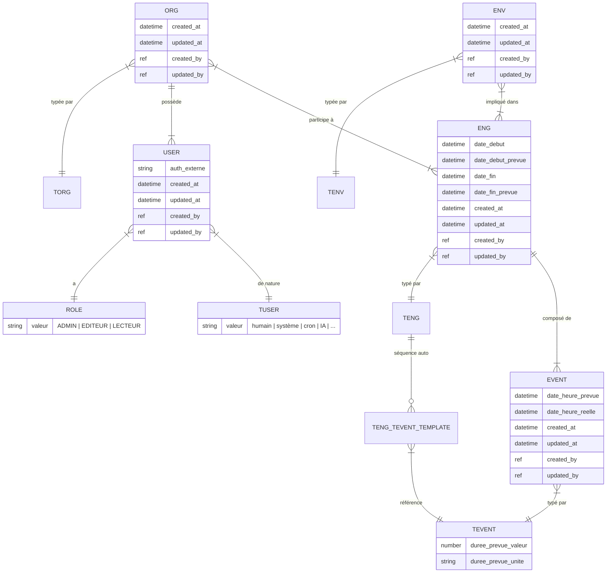
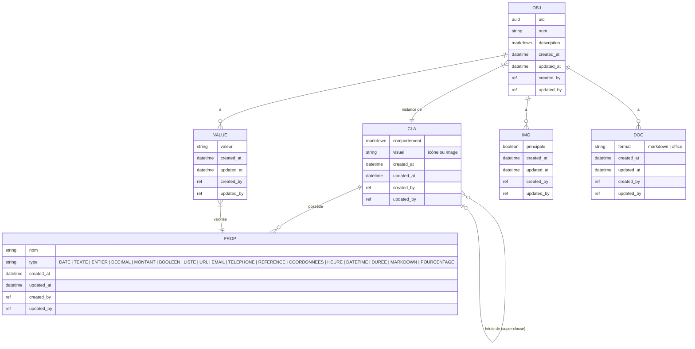
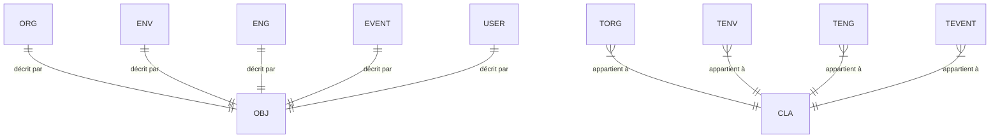
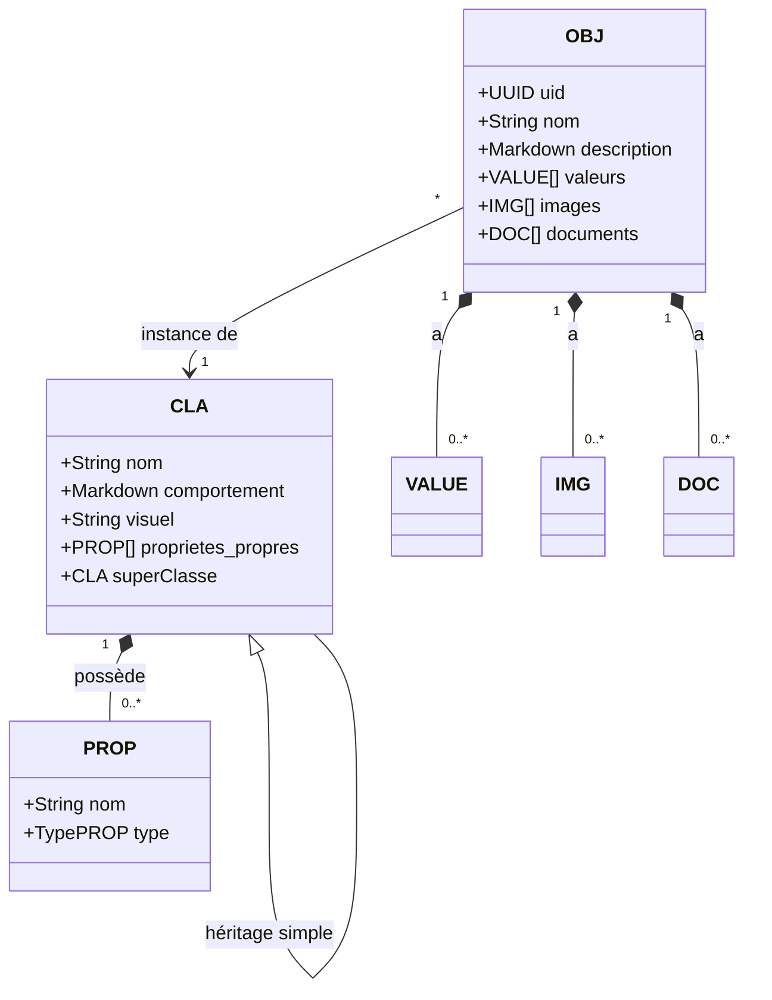

# Modèle de domaine — be.CLEAR

## Vue d'ensemble

Le domaine est organisé en deux parties complémentaires :
- **Activité** : les entités métier (ORG, ENV, ENG, EVENT, USER) et leurs types
- **Objet** : le système de description générique inspiré de l'OOP (OBJ, CLA, PROP, VALUE)

Chaque entité de la partie Activité est reliée à un OBJ de la partie Objet. Le TYPE de l'entité détermine sa CLA, donc ses PROP disponibles, son comportement et son visuel.

---

## Diagramme 1 — Partie Activité

---

## Diagramme 2 — Partie Objet

---

## Diagramme 3 — Lien Activité ↔ Objet

---

## Diagramme 4 — Hiérarchie des CLA

---

## Règles de gestion

| # | Règle |
|---|-------|
| R01 | Un ENG implique 1..n ORG et 1..n ENV |
| R02 | Un EVENT appartient à exactement 1 ENG |
| R03 | Les EVENTs d'un ENG sont ordonnés par `date_heure_prevue` |
| R04 | `date_heure_prevue` du 1er EVENT ne peut pas être antérieure à `date_début` de l'ENG |
| R05 | À la création d'un EVENT, le système suggère `date_heure_prevue` = `date_heure_prevue précédent EVENT` + `durée TEVENT précédent` |
| R05b | Un EVENT est accompli quand `date_heure_reelle` est renseignée |
| R06 | Chaque ORG, ENV, ENG, EVENT et USER est relié à exactement 1 OBJ |
| R07 | Un OBJ appartient à exactement 1 CLA |
| R08 | Une CLA hérite d'au plus 1 super-classe (héritage simple) |
| R09 | Un OBJ a exactement 1 VALUE par PROP (propres + héritées) de sa CLA |
| R10 | Un OBJ peut avoir 0..n IMG dont exactement 1 désignée image principale |
| R11 | Une ORG peut changer de TORG dans le temps (historique conservé dans `org_torg_history`) |
| R11b | Un ENV peut changer de TENV dans le temps (historique conservé dans `env_tenv_history`) |
| R12 | Un USER humain appartient à exactement 1 ORG et possède 1 ROLE |
| R13 | Les USER non-humains sont hors système de ROLE et agissent avec droits ADMIN |
| R14 | Toute opération (création, modification, suppression) est tracée dans le LOG |
| R15 | Une sous-classe hérite du visuel de sa super-classe par défaut, mais peut le surcharger |
