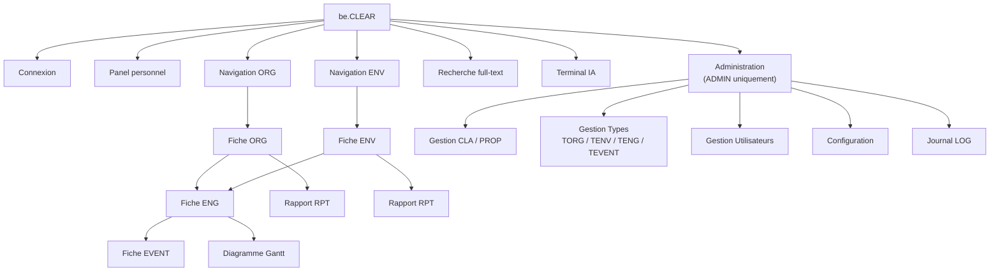
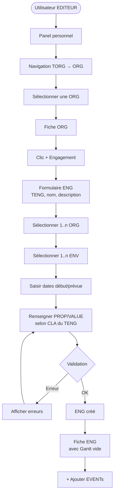
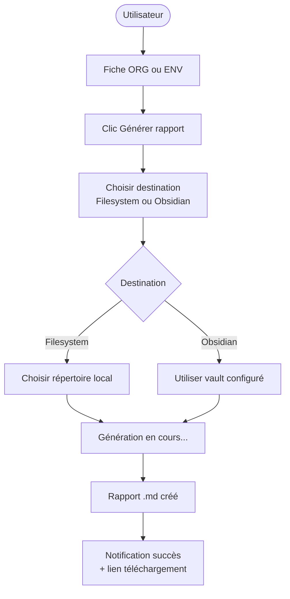

# UX / GUI — be.CLEAR

## Principes de design

| Principe | Description |
|----------|-------------|
| **Clarté** | L'interface reflète le nom de l'application — chaque écran a un objectif unique et lisible |
| **Hiérarchie visuelle** | Les entités principales (ORG, ENV, ENG, EVENT) sont toujours reconnaissables grâce au visuel de leur CLA (icône ou image) |
| **Progressivité** | Les fonctions avancées (CLA, PROP, CONFIG) sont réservées aux ADMIN et masquées pour les autres rôles |
| **Cohérence** | Toutes les fiches entité suivent la même structure : en-tête → données → relations → médias |
| **Feedback** | Chaque action (création, modification, erreur) donne un retour immédiat à l'utilisateur |

---

## Charte chromatique des types

Chaque catégorie de type possède une couleur identitaire appliquée de façon cohérente dans toute l'interface : badges, sélections, survols, anneaux de focus.

| Type | Couleur | Utilisation |
|------|---------|-------------|
| **TORG** | 🔵 Bleu (`blue`) | Badges de type ORG, sidebar de navigation ORG, sélection active dans la liste ORG |
| **TENV** | 🟠 Orange (`orange`) | Badges de type ENV, sidebar de navigation ENV, sélection active dans la liste ENV |
| **TENG** | 🟡 Ambre (`amber`) | Badges de type ENG dans les tableaux et fiches, jauge d'avancement « en cours » |
| **TEVENT** | 🟣 Violet (`violet`) | Badges de type EVENT dans les fiches EVENT |

### Règles de cohérence

- Les badges de type sont des **pill** (`rounded-full`) sur les fiches détail, des **tag** (`rounded`) dans les tableaux
- La couleur TENG (ambre) s'applique aussi à la **jauge d'avancement** des ENG (état « en cours » = > 0% et < 100%)
- L'état « accompli » (100%) reste vert (`green`) — couleur sémantique universelle
- L'état « non démarré » (0%) reste gris neutre
- Les classes Tailwind de référence sont centralisées dans `frontend/src/lib/entityColors.ts`

---

## Architecture de l'information



---

## Layout global

```
┌─────────────────────────────────────────────────────────────┐
│  BARRE SUPÉRIEURE                                           │
│  [Logo be.CLEAR]    [🔍 Recherche globale]   [👤 USER]      │
├──────────────┬──────────────────────────────────────────────┤
│              │                                              │
│  SIDEBAR     │  ZONE DE CONTENU PRINCIPALE                  │
│              │                                              │
│  ▶ Panel     │                                              │
│  ▶ ORG       │                                              │
│  ▶ ENV       │                                              │
│  ─────────   │                                              │
│  ▶ Terminal  │                                              │
│    IA        │                                              │
│  ─────────   │                                              │
│  ▶ Admin     │                                              │
│    (ADMIN)   │                                              │
│              │                                              │
└──────────────┴──────────────────────────────────────────────┘
```

---

## Écran 1 — Connexion

```
┌─────────────────────────────────────┐
│                                     │
│         [Logo be.CLEAR]             │
│                                     │
│   ┌─────────────────────────────┐   │
│   │  Identifiant                │   │
│   └─────────────────────────────┘   │
│   ┌─────────────────────────────┐   │
│   │  Mot de passe               │   │
│   └─────────────────────────────┘   │
│                                     │
│   [ Se connecter ]                  │
│                                     │
│   ─── ou ───                        │
│   [ Connexion SSO / OAuth ]         │
│                                     │
└─────────────────────────────────────┘
```

---

## Écran 2 — Panel personnel

```
┌─────────────────────────────────────────────────────────────┐
│  Bonjour, [Prénom NOM]  •  [ORG]  •  ROLE : [EDITEUR]       │
├─────────────────────────────────────────────────────────────┤
│  Mes créations récentes                          [Voir tout] │
│                                                             │
│  ┌──────────┐ ┌──────────┐ ┌──────────┐ ┌──────────┐       │
│  │ [IMG]    │ │ [IMG]    │ │ [IMG]    │ │ [IMG]    │       │
│  │ Nom OBJ  │ │ Nom OBJ  │ │ Nom OBJ  │ │ Nom OBJ  │       │
│  │ [CLA]    │ │ [CLA]    │ │ [CLA]    │ │ [CLA]    │       │
│  │ ORG/ENG  │ │ ORG/ENG  │ │ ORG/ENG  │ │ ORG/ENG  │       │
│  └──────────┘ └──────────┘ └──────────┘ └──────────┘       │
│                                                             │
│  Activité récente                                           │
│  ┌─────────────────────────────────────────────────────┐   │
│  │ [icône] Créé : [Nom OBJ]  •  [date]                 │   │
│  │ [icône] Modifié : [Nom OBJ]  •  [date]              │   │
│  │ [icône] Créé : [Nom OBJ]  •  [date]                 │   │
│  └─────────────────────────────────────────────────────┘   │
└─────────────────────────────────────────────────────────────┘
```

---

## Écran 3 — Navigation TORG → ORG

```
┌──────────────────────────────────────────────────────────────┐
│  Organisations                              [ + Nouvelle ORG ]│
├────────────────────┬─────────────────────────────────────────┤
│  ARBORESCENCE      │  ORG de ce type : Entreprises / PME      │
│                    │                                          │
│  ▼ Entreprises     │  ┌──────────┐ ┌──────────┐              │
│    ▼ PME           │  │ [IMG]    │ │ [IMG]    │              │
│      Artisan   ●   │  │ Acme SA  │ │ Dupont   │              │
│      TPE           │  │ PME      │ │ PME      │              │
│    Grand groupe    │  └──────────┘ └──────────┘              │
│  ▶ Associations    │                                          │
│  ▶ Collectivités   │  [Vue liste] [Vue grille]                │
│                    │                                          │
│  [ + Ajouter nœud ]│                                         │
└────────────────────┴─────────────────────────────────────────┘
```

- Le nœud sélectionné (●) filtre les ORG affichées à droite
- Bascule entre vue grille (cartes avec image) et vue liste
- Bouton `+ Nouvelle ORG` pré-sélectionne le TORG courant

---

## Écran 4 — Fiche ORG

```
┌──────────────────────────────────────────────────────────────┐
│  ← Retour          ORG  •  [TORG: PME / Artisan]   [ ✎ ][ ⋮]│
├──────────────────────────────────────────────────────────────┤
│  ┌─────────┐   Acme Corporation                              │
│  │  [IMG   │   ─────────────────────────────                 │
│  │ princi- │   Description (Markdown rendu)                  │
│  │  pale]  │                                                 │
│  └─────────┘   SIRET : 12345678900010                        │
│                CA annuel : 850 000 €                         │
│                Pays : France                                 │
│                                                              │
│  ┌───────────────────────────────────────────────────────┐  │
│  │ ENGAGEMENTS                          [ + Engagement ] │  │
│  │ ┌─────────────────────────┬──────────┬────────────┐   │  │
│  │ │ Nom ENG                 │ TENG     │ Avancement │   │  │
│  │ │ Projet Alpha            │ Contrat  │ ████░░ 67% │   │  │
│  │ │ Mission Beta            │ Mission  │ ██░░░░ 33% │   │  │
│  │ └─────────────────────────┴──────────┴────────────┘   │  │
│  └───────────────────────────────────────────────────────┘  │
│                                                              │
│  ┌──────────────┐  ┌──────────────┐  ┌──────────────────┐  │
│  │ UTILISATEURS │  │    IMAGES    │  │    DOCUMENTS     │  │
│  │ 3 users      │  │ 2 images     │  │ 1 document       │  │
│  └──────────────┘  └──────────────┘  └──────────────────┘  │
│                                                              │
│  [ 📄 Générer rapport ]                                      │
└──────────────────────────────────────────────────────────────┘
```

---

## Écran 5 — Fiche ENG avec Gantt

```
┌──────────────────────────────────────────────────────────────┐
│  ← Retour       ENG  •  [TENG: Contrat]          [ ✎ ][ ⋮ ] │
├──────────────────────────────────────────────────────────────┤
│  Projet Alpha                    Avancement : ████░░ 67%     │
│  ──────────────────────────────────────────────────────────  │
│  ORG : Acme Corporation    ENV : Ministère du Commerce       │
│  Début : 01/03/2025        Fin prévue : 30/06/2025           │
│                                                              │
│  ┌───────────────────────────────────────────────────────┐  │
│  │ DIAGRAMME DE GANTT                                    │  │
│  │                                                       │  │
│  │ ```mermaid                                            │  │
│  │ gantt                                                 │  │
│  │   Réunion de lancement : 2025-03-01, 1d               │  │
│  │   Phase étude          : 2025-03-02, 30d              │  │
│  │   Livraison rapport    : 2025-04-01, 2d               │  │
│  │ ```                                                   │  │
│  └───────────────────────────────────────────────────────┘  │
│                                                              │
│  ┌───────────────────────────────────────────────────────┐  │
│  │ ÉVÈNEMENTS                          [ + Évènement ]   │  │
│  │ ✅ Réunion de lancement  Prévu 01/03  Réel 01/03  1j   │  │
│  │ ✅ Phase étude           Prévu 02/03  Réel 03/03  30j  │  │
│  │ ⏳ Livraison rapport     Prévu 01/04  Réel —      2j   │  │
│  └───────────────────────────────────────────────────────┘  │
└──────────────────────────────────────────────────────────────┘
```

---

## Écran 6 — Fiche EVENT

```
┌──────────────────────────────────────────────────────────────┐
│  ← Retour ENG       EVENT  •  [TEVENT: Livraison]  [ ✎ ][ ⋮]│
├──────────────────────────────────────────────────────────────┤
│  ┌─────────┐   Livraison rapport final                       │
│  │  [IMG]  │   ──────────────────────────────                │
│  └─────────┘   Description (Markdown rendu)                  │
│                                                              │
│  Date prévue     : 01/04/2025 09:00                         │
│  Date réelle     : —  (non encore réalisé)                  │
│  Durée prévue    : 2 jours (hérité du TEVENT)               │
│  Durée réelle    : —                                         │
│                                                              │
│  PROPRIÉTÉS                                                  │
│  ┌──────────────────────┬──────────────────────────────┐    │
│  │ Responsable          │ Marie Dupont                 │    │
│  │ Statut               │ En cours                     │    │
│  │ Livrable             │ https://docs.acme.com/v2     │    │
│  └──────────────────────┴──────────────────────────────┘    │
└──────────────────────────────────────────────────────────────┘
```

---

## Écran 7 — Recherche full-text

```
┌──────────────────────────────────────────────────────────────┐
│  🔍  [ acme contrat __________________ ]   [Rechercher]      │
├──────────────────────────────────────────────────────────────┤
│  12 résultats pour "acme contrat"                            │
│                                                              │
│  Filtrer par : [Tous ▾]  [ORG]  [ENV]  [ENG]  [EVENT]       │
│                                                              │
│  ┌───────────────────────────────────────────────────────┐  │
│  │ [icône CLA]  Acme Corporation          TYPE : ORG     │  │
│  │ ...société **acme** spécialisée dans les **contrats** │  │
│  └───────────────────────────────────────────────────────┘  │
│  ┌───────────────────────────────────────────────────────┐  │
│  │ [icône CLA]  Projet Alpha              TYPE : ENG     │  │
│  │ ...engagement de type **contrat** avec **Acme**...    │  │
│  └───────────────────────────────────────────────────────┘  │
└──────────────────────────────────────────────────────────────┘
```

---

## Écran 8 — Terminal IA

```
┌──────────────────────────────────────────────────────────────┐
│  Terminal IA              LLM : [ Ollama (local) ▾ ]        │
├──────────────────────────────────────────────────────────────┤
│                                                              │
│  ┌───────────────────────────────────────────────────────┐  │
│  │ 👤 Quels sont les engagements en retard ce mois-ci ?  │  │
│  └───────────────────────────────────────────────────────┘  │
│                                                              │
│  ┌───────────────────────────────────────────────────────┐  │
│  │ 🤖 J'ai identifié 2 engagements en retard :           │  │
│  │                                                       │  │
│  │ • **Projet Alpha** (Acme Corp) — prévu 30/06,         │  │
│  │   accomplissement 67%, risque de dépassement          │  │
│  │ • **Mission Beta** — aucun EVENT depuis 15 jours      │  │
│  │                                                       │  │
│  │ Sources : ENG#12, ENG#18                              │  │
│  └───────────────────────────────────────────────────────┘  │
│                                                              │
│  ┌─────────────────────────────────────┐ [Envoyer ↵]       │
│  │ Posez votre question...             │                    │
│  └─────────────────────────────────────┘                    │
└──────────────────────────────────────────────────────────────┘
```

---

## Écran 9 — Administration CLA

```
┌──────────────────────────────────────────────────────────────┐
│  Administration › Classes                  [ + Nouvelle CLA ] │
├───────────────────┬──────────────────────────────────────────┤
│  HIÉRARCHIE CLA   │  CLA : Entreprise                        │
│                   │  ─────────────────────────────────────── │
│  ▼ Entité         │  Super-classe : Entité                   │
│    ▼ Entreprise   │  Visuel : 🏢 (icône)                     │
│       PME     ●   │                                          │
│       ETI         │  Comportement :                          │
│    Personne       │  ┌──────────────────────────────────┐   │
│    Organisme      │  │ Une entreprise est une entité... │   │
│                   │  └──────────────────────────────────┘   │
│                   │                                          │
│                   │  PROPRIÉTÉS          [ + Propriété ]     │
│                   │  ┌──────────┬──────────┬──────────────┐  │
│                   │  │ Nom      │ Type     │ Héritage     │  │
│                   │  │ nom      │ TEXTE    │ ✅ Entité    │  │
│                   │  │ pays     │ LISTE    │ ✅ Entité    │  │
│                   │  │ siret    │ TEXTE    │ propre       │  │
│                   │  │ CA       │ MONTANT  │ propre       │  │
│                   │  └──────────┴──────────┴──────────────┘  │
└───────────────────┴──────────────────────────────────────────┘
```

---

## Parcours utilisateur — Créer un ENG



---

## Parcours utilisateur — Générer un rapport RPT



---

## Responsive et accessibilité

| Contexte | Comportement |
|----------|-------------|
| **Desktop** (≥1280px) | Layout sidebar + contenu — mode par défaut |
| **Tablette** (768–1279px) | Sidebar rétractable via bouton hamburger |
| **Mobile** (< 768px) | Navigation par onglets en bas d'écran — lecture seule conseillée |
| **Accessibilité** | Contrastes WCAG AA, navigation clavier, labels ARIA sur tous les formulaires |
